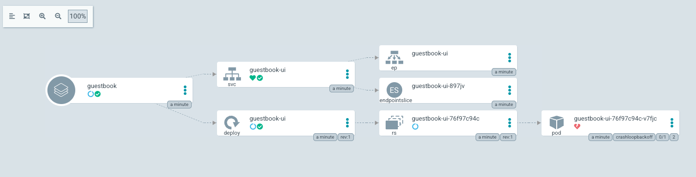

# Argo CD

Argo CD 是一套針對 kubernetes 持續部署工具。

> 本篇環境都在 Mac M1 使用 [lima]() 所創建的 kubernetes。

## lima

由 **lima** 的範例 `k8s.yaml` 所創建的 kubernetes，只有單節點，並且有加上 `taints`，要將其移除以方便後續 pods 的生長：

```yaml
taints:
- effect: NoSchedule
  key: node-role.kubernetes.io/master
```

## 安裝

創建命名空間 `argocd`，並部署 **argo cd**：

```bash
$ kubectl create namespace argocd
$ kubectl apply -n argocd -f https://raw.githubusercontent.com/argoproj/argo-cd/stable/manifests/install.yaml
```

安裝 `argocd` 指令：

```bash
$ brew install argocd
```

## 登入

將 `argocd-server` 的傳輸埠轉發：

```
kubectl port-forward svc/argocd-server -n argocd 8080:443
```

> 因為只是本地試驗用，正式環境應撰寫 ingress。

透過下面指令，獲取初始的預設密碼：

```bash
$ kubectl -n argocd get secret argocd-initial-admin-secret -o jsonpath="{.data.password}" | base64 -d; echo
```

在本地端登入 **argo cd**：

```bash
$ argocd login <SERVER_IP_HOST:PORT> --insecure
```

## 利用儲存庫創建應用

透過指令添加應用來源和指定部署的位址，最後透過 `sync` 同步部署到指定的 kubernetes：

```bash
$ argocd app create guestbook \
    --repo https://github.com/argoproj/argocd-example-apps.git \
    --path guestbook \
    --dest-server https://kubernetes.default.svc \
    --dest-namespace default
$ argocd app sync guestbook
```

訪問下面網址，就會看到上面部署的應用：

```
$ https://localhost:8080/applications/guestbook?resource=
```




> 會發現 `guestbook-ui` 始終 `CrashLoopBackOff`，原因是 CPU 架構所導致。下面輸出是透過 `docker run` 運行所輸出的：
> ```
> WARNING: The requested image's platform (linux/amd64) does not match the detected host platform (linux/arm64/v8) and no specific platform was requested
> ```
>
> 在 kubernetes 上的輸出：
> ```
> exec /usr/local/bin/docker-php-entrypoint: exec format error
> ```
