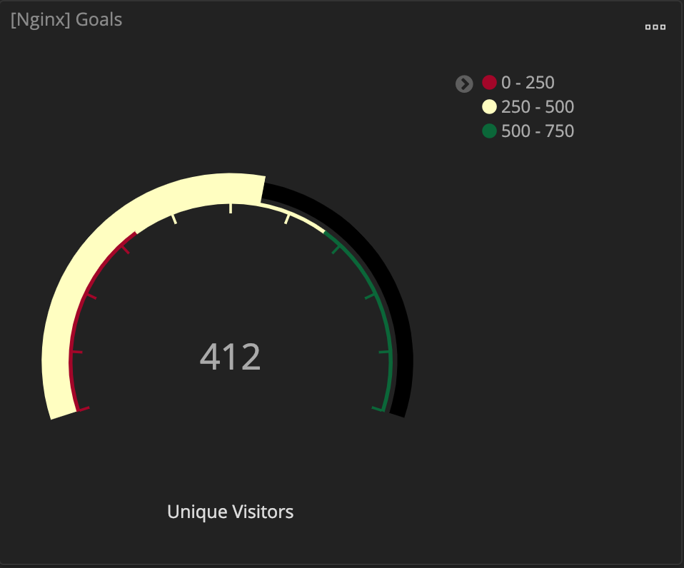
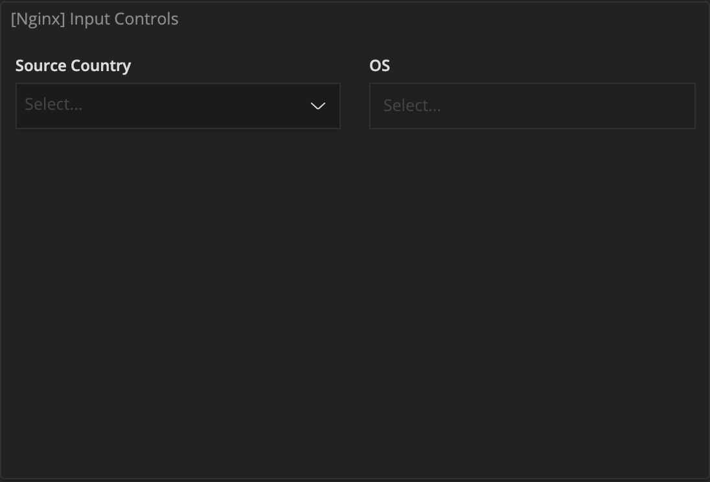
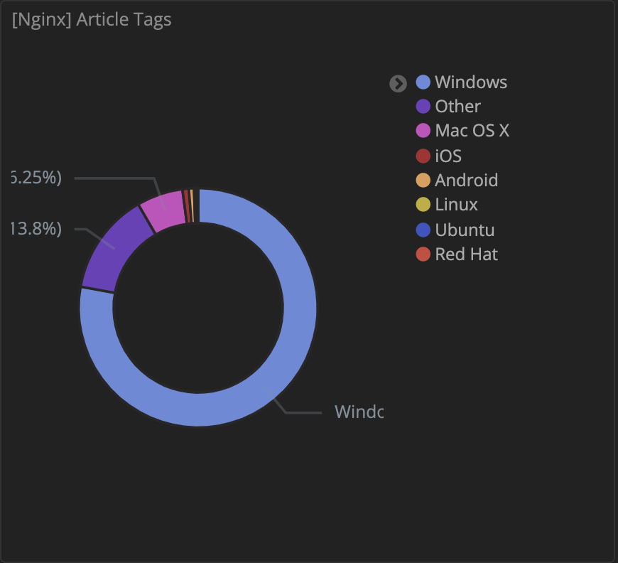
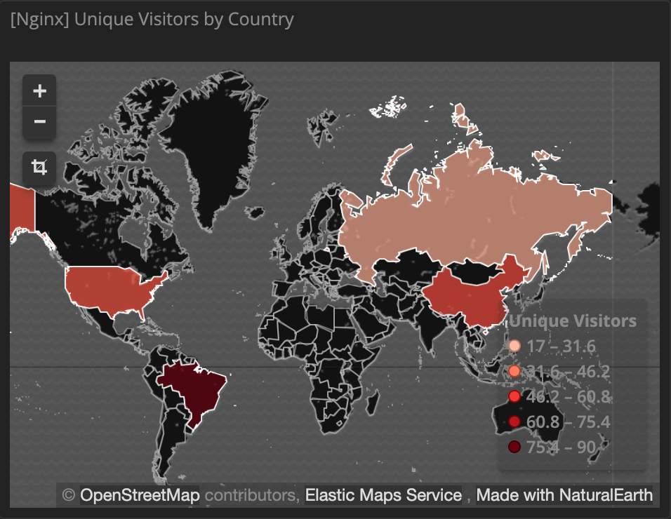

# Collect nginx log  

## Environment requirement
- Hostname：elk
    - ip 192.168.200.1

- Hostname：nginx
    - ip 192.168.200.2


## ELK
請參考 [ELK](../) 主頁，將應用安裝在 `hostname：elk`。

## Nginx 
請在 `hostname：nginx` 操作。

### install 

#### On ubuntu
```bash 
$ sudo apt-get install nginx 
```

#### On docker
```bash
$ sudo docker run \
    --name log-nginx \
    --mount type=bind,src=/var/log/nginx/,dst=/var/log/nginx/ \
    --mount type=bind,src=$(pwd)/nginx/sites-enabled/,dst=/etc/nginx/sites-enabled/ \
    -p 80:80 \
    -d lab.yukifans.com/library/nginx-alpine:1.12.2
```

### configure 

如果是用 ubunut 安裝 nginx，需要將配置檔複製進去。
```
$ sudo cp nginx/sites-enabled/default /etc/nginx/sites-enabled/default
```

如果想自定義的 log 格式，可參考：
- [nginx-log-format](./../../../nginx/log-format.md)


## Logstash 
請在 `hostname：nginx` 操作。

### Install

#### On docker

```bash
sudo docker run \
    --name log-logstash \
    --mount type=bind,src=/var/log/nginx/,dst=/var/log/nginx/,readonly \
    --mount type=bind,src=$(pwd)/nginx/logstash-conf/config/logstash.yml,dst=/usr/share/logstash/config/logstash.yml \
    --mount type=bind,src=$(pwd)/nginx/logstash-conf/pipeline,dst=/usr/share/logstash/pipeline \
    -d lab.yukifans.com/mis-application/elk_logstash
```

### configure

如果 nginx 的 log 格式有修改，該文件提供的配置檔 `logstash-conf/pipeline/nginx.conf` 也需要進行調整。

請參考 - [logstash](../logstash)

## Kibana

### Management

點擊 *Create index pattern*

#### Step 1
*index pattern* 輸入框輸入 `harbor-host`，點擊 Next-step。

#### Step 2
*Time Filter field name*  選擇 [**I don't want to use the Timer Filter**]，點擊 *Create index pattern*。


### Visualize

進入該頁面，點擊  ，以新增想要的資料可視化圖表。


#### Goal



選擇 *Data* 列表下的 *Goal*。

*From a New Search, Select Index* 選擇 `harbor-host`。

- Data 

將 *Metrics* 底下的 Mitric 點開。*Aggregation* 選擇 [**Unique Count**]，*Field* 選擇 [**remote_addr.keyword**]，*Custom Label* 輸入 `Unique Visitors`。

- Options

勾選 [**Auto Extend Range**]，自行新增 Ranges 數量範圍，可參照圖表新增。*Color* 與 *Style* 可依照個人需求調整。

#### Controls



選擇 *Other* 列表下的 *Controls*。

*From a New Search, Select Index* 選擇 `harbor-host`。

- Data 

將 *Metrics* 底下的 Mitric 點開。*Aggregation* 選擇 [**Unique Count**]，*Field* 選擇 [**remote_addr.keyword**]，*Custom Label* 輸入 `Unique Visitors`。

- Options

勾選 [**Auto Extend Range**]，自行新增 Ranges 數量範圍，可參照圖表新增。*Color* 與 *Style* 可依照個人需求調整。

#### Pie



#### Region Map



### Dashboard

