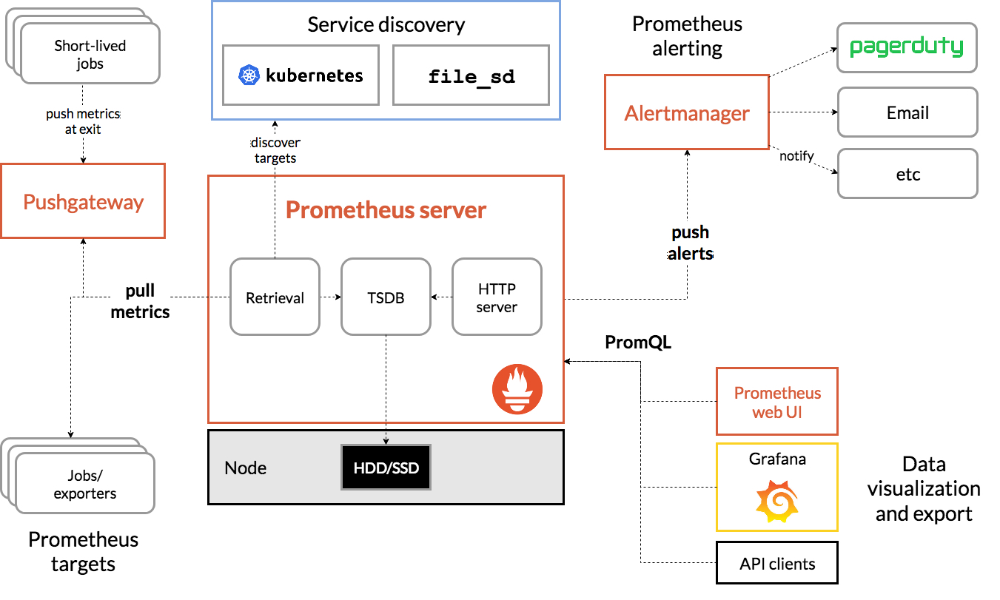

# Prometheus

Prometheus 是一個開源系統監控和警示的工具包。

Prometheus 在 2016 加入 Cloud Native Computing Foundation，成為第二個託管的專案。

## Architecture

## Table of contents
- [Glossary](./glossary.md)
- [Server](./server)
- [Alertmanager](./alertmanager)