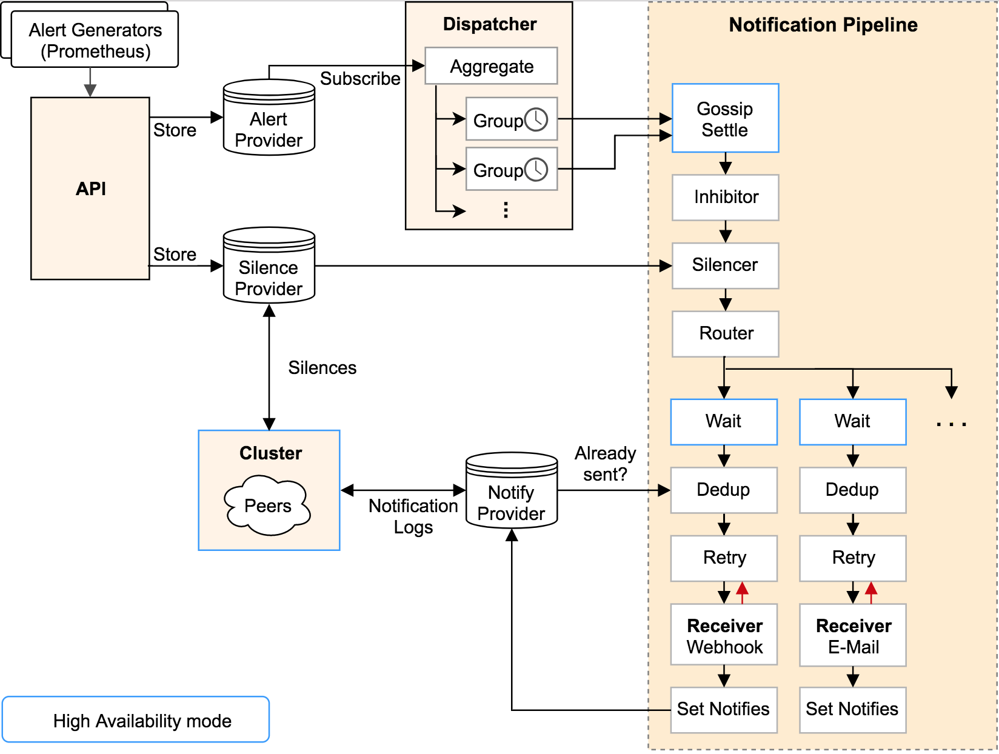
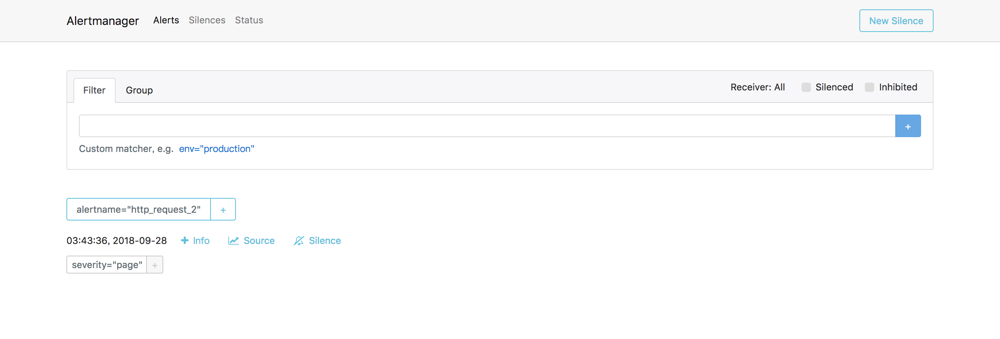

# Alertmanager

## Architecture


## Table of contents
- [Installation](./#installation)
- [Config](./config)

## Installation 
```bash
$ docker run -p 9093:9093 --name alertmanager \
    -v $(pwd)/config.yml:/etc/alertmanager/config.yml \
    -d prom/alertmanager
```

**Access web**
```
http://127.0.0.1:9093
```

