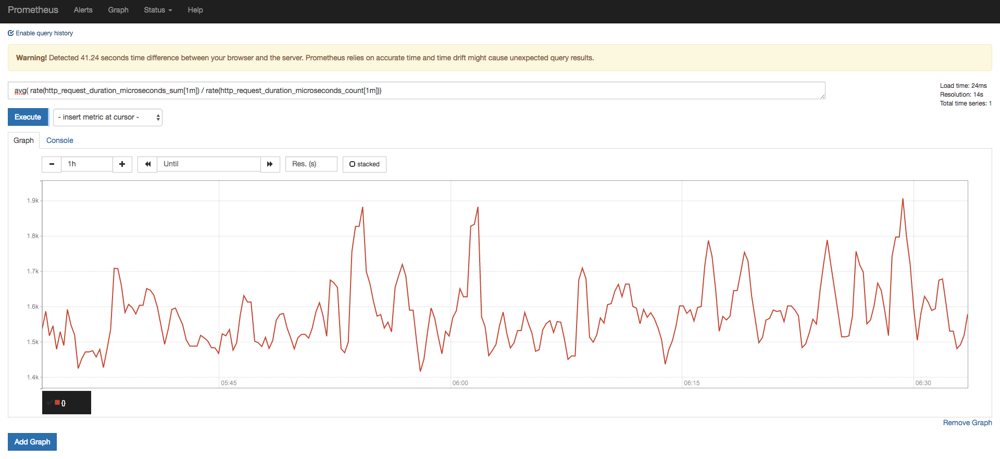

# Server

## Table of contents
- [Installation](./#installation)
- [Data model](./data-model.md)
- [Metric types](./metric-types.md)
- [Collect Docker metrics](./collect-docker-metrics.md)
- [Config](./config)

## Installation

```bash
$ docker run -p 9090:9090 --name prometheus \
    -v $(pwd)/prometheus.yml:/etc/prometheus/prometheus.yml \
    -d prom/prometheus
```

**Access web**
```
http://127.0.0.1:9090
```

