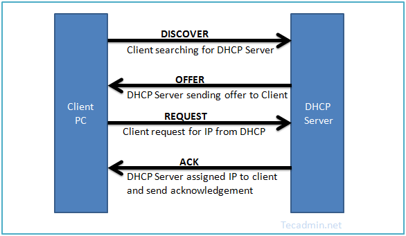

# DHCP
DHCP（Dynamic Host Configuration Protocol）在網路七層協定中，屬於第七層 Application Layer。該網路協定運作於 *Server-Client* 的架構之中，用來讓客戶端（Client side）取得網路相關的設定。

## Table of contents
- [Relay agents](#relay-agents)
- [Assigns IP](#assigns-ip)
- [Processes and Interactions](#processes-and-interactions)
- [Installation](./isc-dhcp-server.md)

## Relay agents
Relay agents 的用途在於接收由用戶端發送的廣播封包，並直接把需求轉給 DHCP 伺服器，接著 DHCP 伺服器會把要回傳的資料丟給 relay agents，並且 relay agents 會協助傳回給所負責的小型網路的用戶端。

## Assigns IP
### Dynamic assign
在伺服器上設定好一個網段範圍和使用期限，即可自動分配給用戶端。

### Rreverse assign
伺服器會根據已定義配置檔，對應 MAC 來分配 IP 。

## Processes and Interactions

1. Discovery：

用戶端會廣播 *Discovery* 已請求 IP 位址及其相關設定（子網路遮罩、預設閘道以及伺服器位址...等）。
>可設定 Relay Agent，達到跨網段。

2. Offer：

伺服器接收 *Discovery* 的廣播後，會回應包含 IP 位址及其相關網路設定的 *Offer*。

3. Request：

用戶端獲取 Offer 封包後，會廣播回應 *Request* 來表示接受該網路資訊設定。

4. Acknowledge：

為客戶端分配地址，伺服器廣播回應 *ACK*，最後確定租約條款。

