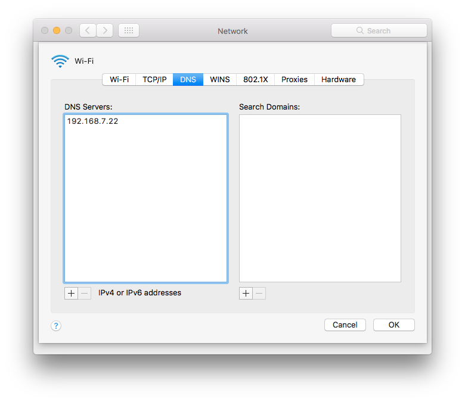

# Bind
BIND（Berkeley Internet Name Daemon）是現今網際網路上最常使用的 **DNS** 伺服器軟體。

DNS（Domain Name System）是將 **域名（Domain）** 和 **IP** 位址相互對映的分散式資料庫，使人方便存取網際網路。

## Foreword
當內部提供服務的設備越來越多時，或許維運人員能夠記住 IP 所對應的設備，但用戶並非能如此。

這時需要架設內部 DNS，提供給用戶較直觀的操作，只需要鍵入有意義的文字，而非數字，即可連接到目的地。

## Environment
- Hostname：dns
  - OS：Ubuntu 14.04
  - IP：192.168.7.22
  - RAM：1G
  - DISK：20G
- Hostname：server
  - OS：Ubuntu 14.04
  - IP：192.168.7.47
  - RAM：1G
  - DISK：20G
- Hostname：Yuki
  - OS：macOS v10.12.6
  - IP：192.168.7.182
- Domain-1：yuki.com
- Domain-2：yuki-dns.com


## Table of contents
- [Install bind](#install-bind)
- [Bind directory](#bind-directory)
- [Configuration structure](#configuration-structure) 
- [Set configuration file](#set-configuration-file)
  - [named.conf.options](#namedconfoptions)
  - [named.conf.local](#namedconflocal)
  - [Forward zone file](#forward-zone-file)
  - [Reverse zone file](#reverse-zone-file)
- [Client set dns](#client-set-dns)

## Install bind
更新並安裝 **bind9**。

```bash
Yuki@dns:~$ sudo apt-get update
Yuki@dns:~$ sudo apt-get instal bind9
```

## Bind directory
Bind 所在的資料夾以及其結構。
```
 /etc/bind
├── bind.keys
├── db.0
├── db.127
├── db.255
├── db.empty
├── db.local
├── db.root
├── named.conf
├── named.conf.default-zones
├── named.conf.local
├── named.conf.options
├── rndc.key
└── zones.rfc1918
```

## Configuration structure

**named.conf** 為主要配置檔，底下顯示為所引入的檔案關係。（`./private` 是個人自行創建的資料夾。）
```
─── named.conf
    ├── named.conf.options
    ├── named.conf.default-zones
    │   ├── db.root
    │   ├── db.local
    │   ├── db.127
    │   ├── db.0
    │   ├── db.255
    │   └── db.empty
    └── named.conf.local
        ├── ./private/yuki.com
        ├── ./private/yuki-dns.com
        └── ./private/192.168.7.rev
```

## Set configuration file

設定檔 `named.conf.options` 裡面有一些描述和功能，但有些功能是預設啟用，可是沒有寫出來。

### named.conf.options
仍然添加預設有啟用，配置檔沒列出的基本功能，以便識別。

```
options {
        directory "/var/cache/bind";

        // The default is port 53 on all server interfaces.
        listen-on port 53 {any;};

        // Defines an match list of IP address(es) which are allowed to
        // issue queries to the server.The default IP address is any.
        allow-query {any;};
        
        // The "8.8.8.8" is DNS of Google.
        forwarders {
                8.8.8.8;
        };

        dnssec-validation auto;

        auth-nxdomain no;    # conform to RFC1035
        listen-on-v6 { any; };
}
```

### named.conf.local
添加區域（網域）的解析資料。
```
// Forward zones
zone "yuki-dns.com" {
        type master;
        file "/etc/bind/private/yuki-dns.com";
};

zone "yuki.com" {
        type master;
        file "/etc/bind/private/yuki.com";
};

// Reverse zones
zone "7.168.192.in-addr.arpa" IN {
        type master;
        file "/etc/bind/private/192.168.7.rev";
};
```

### Forward zone file

**yuki-dns.com**
```
Yuki@dns:/etc/bind$ vi private/yuki-dns.com

$TTL    604800
@       IN      SOA     ns.yuki-dns.com. admin.yuki-dns.com. (
                              2         ; Serial
                         604800         ; Refresh
                          86400         ; Retry
                        2419200         ; Expire
                         604800 )       ; Negative Cache TTL

@                     IN      NS     ns.yuki-dns.com.
ns.yuki-dns.com.      IN      A      192.168.7.22
```

**yuki.com**
```
Yuki@dns:/etc/bind$ vi private/yuki.com

$TTL    604800
@       IN      SOA     ns.yuki-dns.com. admin.yuki-dns.com. (
                              2         ; Serial
                         604800         ; Refresh
                          86400         ; Retry
                        2419200         ; Expire
                         604800 )       ; Negative Cache TTL

@                     IN      NS      ns.yuki-dns.com.

www.yuki.com.         IN      A       192.168.7.47
web.yuki.com.         IN      CNAME   www.yuki.com.
```

### Reverse zone file

```
Yuki@dns:/etc/bind$ vi private/192.168.7.rev

$TTL    604800
@       IN      SOA     ns.yuki-dns.com. admin.yuki-dns.com. (
                              2         ; Serial
                         604800         ; Refresh
                          86400         ; Retry
                        2419200         ; Expire
                         604800 )       ; Negative Cache TTL

@                      IN      NS      ns.yuki-dns.com.

47                     IN      PTR     www.yuki.com.
47                     IN      PTR     web.yuki.com.
```

## Client set dns



設定完畢後，使用 `nslookup` 驗證。
```
YUKIde-MacBook-Pro:Desktop yuki$ nslookup

> www.yuki.com
Server:		192.168.7.23
Address:	192.168.7.23#53

Name:	www.yuki.com
Address: 192.168.7.47
> 
> web.yuki.com
Server:		192.168.7.23
Address:	192.168.7.23#53

web.yuki.com	canonical name = www.yuki.com.
Name:	www.yuki.com
Address: 192.168.7.47
> 
> 192.168.7.47
Server:		192.168.7.23
Address:	192.168.7.23#53

47.7.168.192.in-addr.arpa	name = www.yuki.com.
47.7.168.192.in-addr.arpa	name = web.yuki.com.
> exit

YUKIde-MacBook-Pro:Desktop yuki$ 
```
